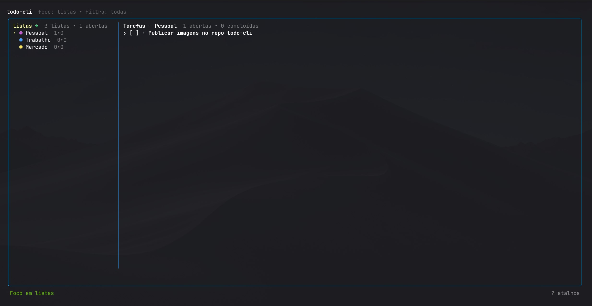

# ✅ todo-cli

A fast, keyboard-first terminal ToDo app built with **Go + Bubble Tea**.

## 🌍 Documentation

- 🇧🇷 **Português (Brasil):** [README.pt-BR.md](README.pt-BR.md)
- 🇺🇸 **English:** [README.en.md](README.en.md)

## Quick highlights

- Multiple lists with color
- Task priorities (`1..4`)
- Incremental search + status filters
- Undo support (`u`)
- Archive/history for completed tasks
- JSON autosave + backup recovery

---

If you want the complete guide, keymaps, and architecture diagrams, open one of the language-specific READMEs above.
